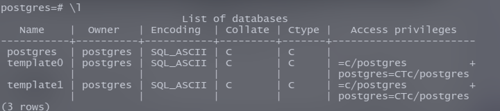
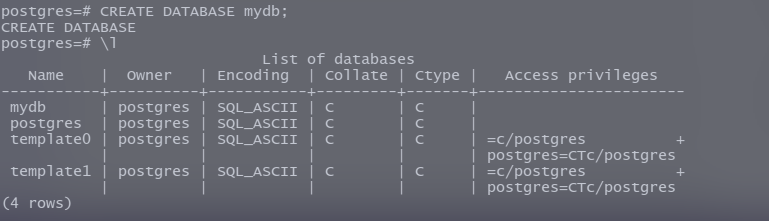
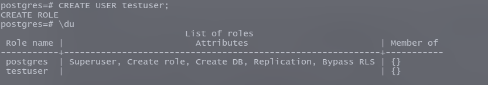
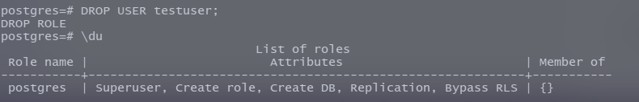
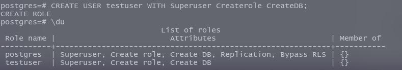
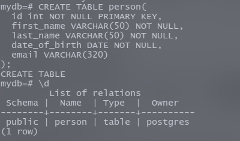

##1. Installation
To install postgresql type the following command on terminal :

If you use arch based distro :
>sudo pacman -S postgresql    


If you use ubuntu :
>sudo apt-get install postgresql


---
## 2. Creating roles and databases
Postgres uses *roles* to handle authentication and authorization of databases. You can think of roles as linux system's user accounts. Though they are not exactly similar.

The installation of postgreSQL will make a default role called 'postgres'. Think of it as the superuser of the postgresql database. So at first you have to enter as the default role 'postgres'. To do so type :

>sudo -i -u postgres

Then, to initialize datbase cluster , use this command:
> initdb --locale $LANG -E UTF8 -D '/var/lib/postgres/data/'


After that you have to start and enable postgresql.service :
>systemctl enable postgresql

>systemctl start postgresql


#####now you are ready to create roles and databases in postgresql


Now enter ``psql`` in the termianl, then you will see this:

 

  To see the existing databases use ``\l``

 

  There are 3 databases by default. ``postgres``  ``template0`` and ``template1``. You can see in the owner column that the owner of these three databases are ``postgres``. 

  And to see existing roles use ``\du``

 

  We can see that the default role is ``postgres`` which has sevral attributes.
  The default role is ``postgres`` which has sevral attributes such as Superuser, Create role, create DB, Replication, Bypass RLS.   ``Superuser`` means this user is not subject to access controls. ``Create role``  means this user can create another roles. ``Create DB``  means this user can create databases. 

**To create a new database use :**  ``CREATE DATABASE database_name;``


Notice that the SQL commands are case insensitive meaning that ``create database database_name; `` and ``CREATE DATABASE database_nam //picture//e;`` [ semicolon is mendatory ] will cause the same effect. But it is better to use uppercase letters for SQL commands since one can distinguish between sql keywords and other words this way.




Here a database named ``mydb`` is created :  
    


Notice that output of ``\l`` now shows the ``mydb`` database. In the owner column it shows that the ``mydb`` database is owned by the role ``postgres`` which is the default role of postgresql.

You can also create roles of postgresql with specifying their attibutes. The attributes determines what that user can do . 

**To create a new role use:** ``CREATE USER user_name;`` 
 


Here a user(role) is created named ``testuser`` . But no attributes(permissions) are given. But, let's say we want to give the role some permission. So, lets delete this role and create the same ``testuser`` role again but this time with some attributes.

To delete a role use : ``DROP USER user_name;``
 

To create a role with attributes use : ``CREATE USER WITH attrbute1 atrribute2 attribute3 ... attributeN ;``

 

Here ``testuser`` is created again with three attributes.

To gain a broad knowledge about user management you are suggested to follow this [Link](https://flaviocopes.com/postgres-user-permissions/ "Postgres User Permission").

---


##3. Connecting to a database

**To connect to a database use:** ``\c database_name``


Here we connected to the ``mydb`` database by ``\c mydb``

##4. Creating Tables

**To see the tables/relations of a database use:** ``\d`` 

 

Here, we see that there are no relation in mydb. That's because we haven't created one yet. Let's create one :D .

**To create a table follow this format:** 

~~~~sql
CREATE TABLE table_name(
   field_name1 data_type(size) constraints,
   field_name2 data_type(size) constraints,
   ..........
   ..........
   field_nameN data_type(size) constrains
);
~~~~

>notice that the size of the data_type is not applicable for all data types. Beacause all data type don't require size.

We want to create a table named ``person``
To do this use type following code:
~~~~sql
CREATE TABLE person(
  id int NOT NULL PRIMARY KEY,
  first_name VARCHAR(50) NOT NULL,
  last_name VARCHAR(50) NOT NULL,
  date_of_birth DATE NOT NULL,
  email VARCHAR(320)
);
~~~~

 

##5. Inserting Data

**To insert data into table use**:
```sql
INSERT INTO table_name(field1, field2........,fieldN) 
VALUES(value1, value2........., valueN);
```
Here we want to insert a record into ``person`` table. To do so use:
```sql
INSERT INTO person(first_name,last_name, gender, date_of_birth, country_of_birth, email) VALUES('Gourob','Mazumder', 'Male','1997-12-31','Bangladesh','gourobmazumder@gmail.com');
```
 

##6. Seeing the data
To see the data from the table follow this format:
```sql
SELECT field1, field2... fieldN FROM table_name WHERE condition
```

After ``SELECT`` keyword you have to write the column names you want to see. If you wanyout to see every columns of this table you can write ``*`` instead of mentioning all the columns. The ``WHERE`` part is for applying condition on certain column.

To see all data of ``person``table with all the columns 


 